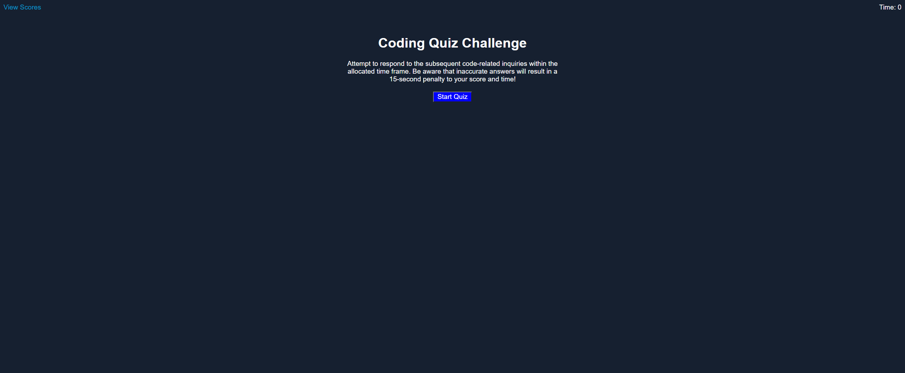
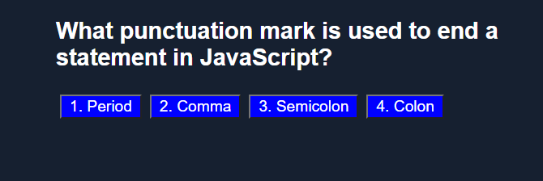
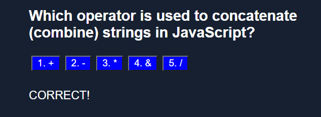
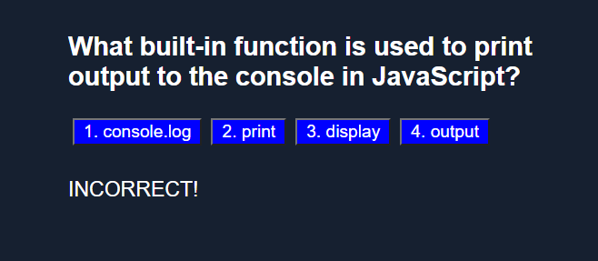
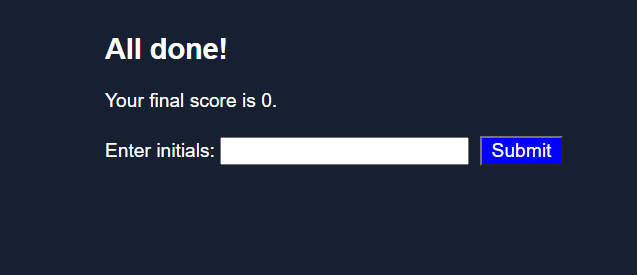

# Module-4-Challenge: JavaScript Quiz

## Description

- I developed a simple JavaScript quiz that utilizes local storage to save users' scores.
- Through this project, I gained a solid understanding of JavaScript logic and Web APIs. 
- Additionally, navigating the DOM during the development process enhanced my comprehension of HTML structure.

## Installation

No installation is required. Simply visit the [live site](https://joseperez013.github.io/JavaScriptQuiz/).

## Usage

- Upon accessing the page, you will encounter a "Start Quiz" button. Clicking this button initiates the quiz.

   

- As the quiz commences, you will be presented with questions. Answer the questions and proceed to the next.

   

- Correct answers are acknowledged with a "Correct" message and a sound.

   

- Incorrect answers are indicated with an "Incorrect" message and a sound.

   

- Upon completing the quiz, your score is calculated based on correct and incorrect answers. You can save your score by submitting your initials.

   

- To view your scores, return to the homepage and click on "View Scores." On the scores page, you have the option to clear your scores or simply view them.

   

## Credits

- Assistance with resolving local host issues: [Mozilla Developer Network](https://developer.mozilla.org/en-US/docs/Web/API/Window/localStorage)
- Problem-solving support: [Stack Overflow](https://stackoverflow.com/)

## License

MIT License

Copyright (c) 2023 JosePerez013

Permission is hereby granted, free of charge, to any person obtaining a copy of this software and associated documentation files (the "Software"), to deal in the Software without restriction, including without limitation the rights to use, copy, modify, merge, publish, distribute, sublicense, and/or sell copies of the Software, and to permit persons to whom the Software is furnished to do so, subject to the following conditions:

The above copyright notice and this permission notice shall be included in all copies or substantial portions of the Software.

THE SOFTWARE IS PROVIDED "AS IS", WITHOUT WARRANTY OF ANY KIND, EXPRESS OR IMPLIED, INCLUDING BUT NOT LIMITED TO THE WARRANTIES OF MERCHANTABILITY, FITNESS FOR A PARTICULAR PURPOSE AND NONINFRINGEMENT. IN NO EVENT SHALL THE AUTHORS OR COPYRIGHT HOLDERS BE LIABLE FOR ANY CLAIM, DAMAGES OR OTHER LIABILITY, WHETHER IN AN ACTION OF CONTRACT, TORT OR OTHERWISE, ARISING FROM, OUT OF OR IN CONNECTION WITH THE SOFTWARE OR THE USE OR OTHER DEALINGS IN THE SOFTWARE.